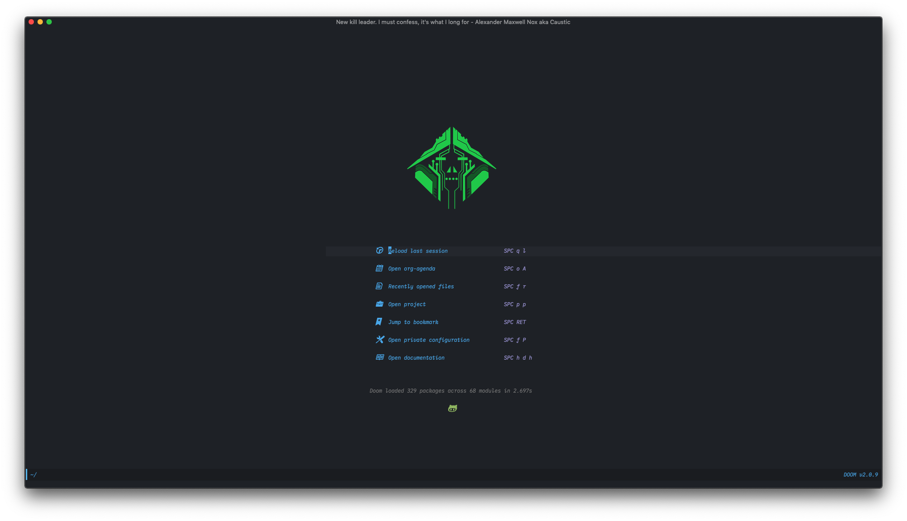
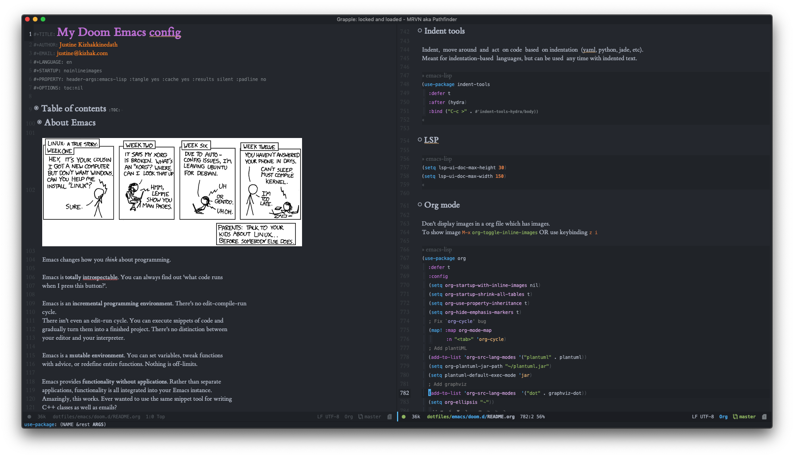
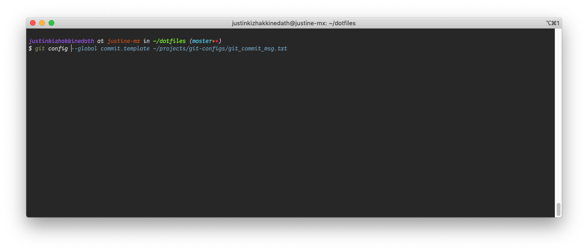

---

---

# My Dotfiles

[[_TOC_]]

# Introduction

They say your dotfiles will most likely be the longest project you ever work on. So for this reason, your dotfiles must be organized in a disciplined manner for maintainability and extensibility.

My dotfiles are the direct reflection of my software development workflow and practices of my past 3 years.

My dotfiles have undergone many transformation from single file vimrc to forking someone else&rsquo;s to building a simple yet sophisticated structure for housing more dotfiles.

One thing you may notice is that my workflow consists of diverse toolkit, this makes it for easier adoption and exploration.

# Features

Contains settings for

- Emacs
  - Doom emacs
  - Spacemacs
- Vim
- Zsh
  - Zim framework
- Tmux
- Custom bash scripts
- Fonts
- VSCode (only install instructions for dotfiles)
- and some terminal settings

# Screenshots

### Doom Emacs - Dashboard

### Doom Emacs - Org mode

### Doom Emacs - Python mode

### ZSH shell

# Getting started

1.  `git clone https://gitlab.com/justinekizhak/dotfiles`
2.  All the instructions are in `devfile.toml`. Use [devinstaller](https://gitlab.com/devinstaller/devinstaller) for installing the packages

# Documentation

Each application has their own documentation in their folders.

| Application | Documentation path                                                     |
| ----------- | ---------------------------------------------------------------------- |
| Doom Emacs  | <https://gitlab.com/justinekizhak/dotfiles/-/tree/master/emacs/doom.d> |
| ZSH         | <https://gitlab.com/justinekizhak/dotfiles/-/tree/master/zsh>          |

_Remaining docs are WIP_

## Repository mirroring

**Gitlab -> Github** repository mirroring.

My main config lives in [Gitlab](https://gitlab.com/justinekizhak/dotfiles), but I do maintain a mirror at [Github](https://github.com/justinekizhak/dotfiles).

The mirroring is done automatically by Gitlab. All I have to do it just keep on pushing commits onto Gitlab.

So here is how to setup the mirroring:

### Step1: Create Github personal token

Instructions <https://docs.github.com/en/github/authenticating-to-github/creating-a-personal-access-token>

### Step2: Mirroring from Gitlab -> Github

Instructions: <http://repositories.compbio.cs.cmu.edu/help/workflow/repository_mirroring.md#setting-up-a-mirror-from-gitlab-to-github>

Make sure to add token in both the URL and in the `password` textfield.

# License

Licensed under the terms of [MIT License](LICENSE.md)

---

