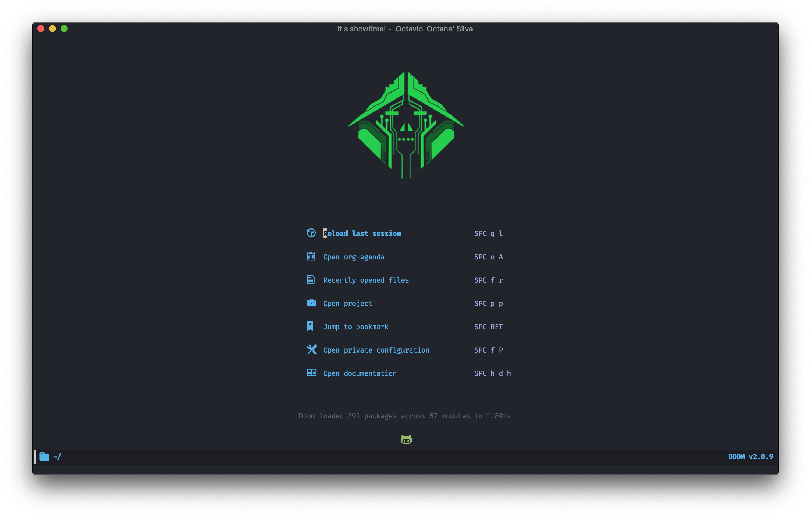

---
author:
- Justine Kizhakkinedath
export_file_name: README
language: en
property: 'header-args :tangle yes :cache yes :results silent :padline
  no'
startup: inlineimages
title: My Doom Emacs config
---

Configuration
=============

Table of Contents [[TOC\_3\_gh]{.smallcaps}]{.tag tag-name="TOC_3_gh"} {#table-of-contents}
======================================================================

-   [Configuration](#configuration)
-   [About Emacs](#about-emacs)
-   [About my config](#about-my-config)
    -   [Screenshot](#screenshot)
    -   [About README](#about-readme)
    -   [Installation](#installation)
    -   [Modification](#modification)
    -   [Contribution](#contribution)
    -   [Special Thanks](#special-thanks)
-   [Lexical Binding](#lexical-binding)
-   [Personal Information](#personal-information)
-   [Improve boot up speed](#improve-boot-up-speed)
    -   [Omit default startup screen](#omit-default-startup-screen)
    -   [Disable
        `package-enable-at-startup`](#disable-package-enable-at-startup)
    -   [Unset
        `file-name-handler-alist`](#unset-file-name-handler-alist)
    -   [Disable `site-run-file`](#disable-site-run-file)
    -   [Disable Unnecessary Interface](#disable-unnecessary-interface)
    -   [Setting up garbage collection for speedy
        startup](#setting-up-garbage-collection-for-speedy-startup)
        -   [Better garbage threshold
            limit](#better-garbage-threshold-limit)
        -   [Garbage collect when Emacs is out of
            focus](#garbage-collect-when-emacs-is-out-of-focus)
-   [Use-Package Settings](#use-package-settings)
-   [Defining constants](#defining-constants)
-   [Some Emacs defaults](#some-emacs-defaults)
-   [Better editing experience](#better-editing-experience)
    -   [Modernize selection behavior](#modernize-selection-behavior)
    -   [Disable scroll bar](#disable-scroll-bar)
    -   [Confirm kill process](#confirm-kill-process)
    -   [Automatically refreshes the buffer for changes outside of
        Emacs](#automatically-refreshes-the-buffer-for-changes-outside-of-emacs)
    -   [Mouse wheel (track-pad) scroll
        speed](#mouse-wheel-track-pad-scroll-speed)
    -   [Show matching parentheses](#show-matching-parentheses)
-   [Appearance](#appearance)
    -   [Setting up some frame
        defaults](#setting-up-some-frame-defaults)
    -   [Dashboard with images](#dashboard-with-images)
-   [Packages](#packages)
    -   [Org mode](#org-mode)
        -   [Ox-gfm](#ox-gfm)
        -   [Org-toc](#org-toc)
    -   [Projectile](#projectile)
    -   [Javascript/Web mode](#javascriptweb-mode)
    -   [Ripgrep](#ripgrep)
    -   [Browse kill ring](#browse-kill-ring)
    -   [Magit](#magit)
    -   [Go to line preview](#go-to-line-preview)
    -   [Clipmon](#clipmon)
    -   [Company](#company)
        -   [Company-lsp](#company-lsp)
        -   [Commpany-box](#commpany-box)
        -   [Company-tabnine](#company-tabnine)
    -   [Dired](#dired)
    -   [Drag lines](#drag-lines)
    -   [Undo visualizer](#undo-visualizer)
    -   [Yasnippet](#yasnippet)
    -   [Treemacs magit](#treemacs-magit)
    -   [2048 game](#2048-game)
    -   [Lentic mode](#lentic-mode)
    -   [Apex Legends quotes](#apex-legends-quotes)
    -   [Zone](#zone)
        -   [Zone md5](#zone-md5)
-   [Languages](#languages)
    -   [Rust](#rust)
    -   [Python](#python)
    -   [Dart](#dart)
    -   [Markdown](#markdown)
    -   [Emacs lisp](#emacs-lisp)
-   [Other config](#other-config)
-   [Post Initialization](#post-initialization)
    -   [Let\'s lower our GC thresholds back down to a sane
        level.](#lets-lower-our-gc-thresholds-back-down-to-a-sane-level)
    -   [Play startup music](#play-startup-music)

About Emacs
===========

Emacs changes how you *think* about programming.

Emacs is **totally introspectable**. You can always find out \'what code
runs when I press this button?\'.

Emacs is an **incremental programming environment**. There\'s no
edit-compile-run cycle. There isn\'t even an edit-run cycle. You can
execute snippets of code and gradually turn them into a finished
project. There\'s no distinction between your editor and your
interpreter.

Emacs is a **mutable environment**. You can set variables, tweak
functions with advice, or redefine entire functions. Nothing is
off-limits.

Emacs provides **functionality without applications**. Rather than
separate applications, functionality is all integrated into your Emacs
instance. Amazingly, this works. Ever wanted to use the same snippet
tool for writing C++ classes as well as emails?

Emacs is full of **incredible software concepts that haven\'t hit the
mainstream yet**. For example:

-   Many platforms have a single item clipboard. Emacs has an **infinite
    clipboard**.
-   If you undo a change, and then continue editing, you can\'t redo the
    original change. Emacs allows **undoing to any historical state**,
    even allowing tree-based exploration of history.
-   Emacs supports a **reverse variable search**: you can find variables
    with a given value.
-   You can perform **structural editing** of code, allowing you to make
    changes without breaking syntax. This works for lisps (paredit) and
    non-lisps (smartparens).
-   Many applications use a modal GUI: for example, you can\'t do other
    edits during a find-and-replace operation. Emacs provides
    **recursive editing** that allow you to suspend what you\'re
    currently doing, perform other edits, then continue the original
    task.

Emacs has a **documentation culture**. Emacs includes a usage manual, a
lisp programming manual, pervasive docstrings and even an interactive
tutorial.

Emacs has a **broad ecosystem**. If you want to edit code in a niche
language, there\'s probably an Emacs package for it.

Emacs doesn\'t have a monopoly on good ideas, and there are other great
tools out there. Nonetheless, we believe the [Emacs learning
curve](https://i.stack.imgur.com/7Cu9Z.jpg) pays off.

*This beautifully written **About EMACS** section credits to
[Remacs](https://github.com/remacs/remacs).*

Also if you want to read more about Emacs, checkout [Why You Should Buy
Into the Emacs
Platform](https://two-wrongs.com/why-you-should-buy-into-the-emacs-platform).

About my config
===============

This Emacs config is a work of many hours of banging my head on a wall.
My Emacs config has gone through many phase. This phase seems to the
most pleasent one

Screenshot
----------



About README
------------

This README is originated from `config.org` that is generated using
`M-x org-gfm-export-to-markdown`. Every block of code is generated
through this function - it exports sections of code from the `elisp/`
directory. You will not see their presence in `init.org`.

Installation
------------

Use the install directions from [Doom
Emacs](https://github.com/hlissner/doom-emacs).

Modification
------------

You have the permission to use, modify, distribute in any way you want.

However, what is *free* stays *free*. After all, this is [GPL](LICENSE).

**Remember** you must manually sync this README with all the new changes
you made by:

1.  Please do **NOT** edit this `README.md` file, edit `config.org`
    instead!
2.  Add
    `#+INCLUDE: "~/.emacs.d/elisp/<place-holder>.el" src emacs-lisp :range-begin "<start-line-wrapper-exclusive>" :range-end "<end-line-wrapper-exclusive>"`
    in the appropriate section in `init.org`.
3.  Enter `C-x C-s` to save and update `:lines`. (if you don\'t see the
    updated effect, run `M-x save-and-update-includes` manually)
4.  Call `M-x org-gfm-export-to-markdown` to update `README.md`
    automatically.

Contribution
------------

If you spotted a bug or you have any suggestions, please fill in an
issue. If you have something to fix, feel free to create a pull request.

Special Thanks
--------------

Everyone starts somewhere, and I started here.
[MatthewZMD](https://github.com/MatthewZMD/.emacs.d) [Henrik Lissner\'s
Doom Emacs](https://github.com/hlissner/doom-emacs)

Lexical Binding
===============

Use lexical-binding. [Why?](https://nullprogram.com/blog/2016/12/22/)

> Until Emacs 24.1 (June 2012), Elisp only had dynamically scoped
> variables, a feature, mostly by accident, common to old lisp dialects.
> While dynamic scope has some selective uses, it's widely regarded as a
> mistake for local variables, and virtually no other languages have
> adopted it.

``` {.commonlisp org-language="emacs-lisp"}
;;; config.el --- -*- lexical-binding: t -*-
```

Personal Information
====================

Let\'s set some variables with basic user information.

``` {.commonlisp org-language="emacs-lisp"}
(setq user-full-name "Justine Kizhakkinedath"
      user-mail-address "justine@kizhak.com")
```

Improve boot up speed
=====================

Omit default startup screen
---------------------------

``` {.commonlisp org-language="emacs-lisp"}
(use-package "startup"
  :ensure nil
  :config (setq inhibit-startup-screen t))
```

Disable `package-enable-at-startup`
-----------------------------------

Package initialize occurs automatically, before `user-init-file` is
loaded, but after `early-init-file`. We handle package initialization,
so we must prevent Emacs from doing it early!

``` {.commonlisp org-language="emacs-lisp"}
(setq package-enable-at-startup nil)
```

Unset `file-name-handler-alist`
-------------------------------

Every file opened and loaded by Emacs will run through this list to
check for a proper handler for the file, but during startup, it won't
need any of them.

``` {.commonlisp org-language="emacs-lisp"}
(defvar file-name-handler-alist-original file-name-handler-alist)
(setq file-name-handler-alist nil)
```

Disable `site-run-file`
-----------------------

``` {.commonlisp org-language="emacs-lisp"}
(setq site-run-file nil)
```

Disable Unnecessary Interface
-----------------------------

It will be faster to disable them here before they\'ve been initialized.

``` {.commonlisp org-language="emacs-lisp"}
(menu-bar-mode -1)
(unless (and (display-graphic-p) (eq system-type 'darwin))
  (push '(menu-bar-lines . 0) default-frame-alist))
(push '(tool-bar-lines . 0) default-frame-alist)
(push '(vertical-scroll-bars) default-frame-alist)
```

Setting up garbage collection for speedy startup
------------------------------------------------

We\'re going to increase the gc-cons-threshold to a very high number to
decrease the load and compile time. We\'ll lower this value
significantly after initialization has completed. We don\'t want to keep
this value too high or it will result in long GC pauses during normal
usage.

``` {.commonlisp org-language="emacs-lisp"}
(eval-and-compile
  (setq gc-cons-threshold 402653184
        gc-cons-percentage 0.6))
```

### Better garbage threshold limit

``` {.commonlisp org-language="emacs-lisp"}
(defvar better-gc-cons-threshold 67108864 ; 64mb
  "The default value to use for `gc-cons-threshold'.

If you experience freezing, decrease this.  If you experience stuttering, increase this.")

(add-hook 'emacs-startup-hook
          (lambda ()
            (setq gc-cons-threshold better-gc-cons-threshold)
            (setq file-name-handler-alist file-name-handler-alist-original)
            (makunbound 'file-name-handler-alist-original)))
```

### Garbage collect when Emacs is out of focus

``` {.commonlisp org-language="emacs-lisp"}
(add-hook 'emacs-startup-hook
          (lambda ()
            (if (boundp 'after-focus-change-function)
                (add-function :after after-focus-change-function
                              (lambda ()
                                (unless (frame-focus-state)
                                  (garbage-collect))))
              (add-hook 'after-focus-change-function 'garbage-collect))
            ;; Avoid garbage collection when using minibuffer
                (defun gc-minibuffer-setup-hook ()
                (setq gc-cons-threshold (* better-gc-cons-threshold 2)))

                (defun gc-minibuffer-exit-hook ()
                (garbage-collect)
                (setq gc-cons-threshold better-gc-cons-threshold))

                (add-hook 'minibuffer-setup-hook #'gc-minibuffer-setup-hook)
                (add-hook 'minibuffer-exit-hook #'gc-minibuffer-exit-hook)))
```

Use-Package Settings
====================

Tell `use-package` to always defer loading packages unless explicitly
told otherwise. This speeds up initialization significantly as many
packages are only loaded later when they are explicitly used.

``` {.commonlisp org-language="emacs-lisp"}
(with-eval-after-load 'use-package
  (setq use-package-always-defer t
        use-package-verbose t))
(eval-and-compile
  (setq use-package-compute-statistics t))
```

Defining constants
==================

``` {.commonlisp org-language="emacs-lisp"}
(defconst *sys/gui*
  (display-graphic-p)
  "Are we running on a GUI Emacs?")

(defconst *sys/win32*
  (eq system-type 'windows-nt)
  "Are we running on a WinTel system?")

(defconst *sys/linux*
  (eq system-type 'gnu/linux)
  "Are we running on a GNU/Linux system?")

(defconst *sys/mac*
  (eq system-type 'darwin)
  "Are we running on a Mac system?")

(defconst *sys/root*
  (string-equal "root" (getenv "USER"))
  "Are you a ROOT user?")

(defconst *rg*
  (executable-find "rg")
  "Do we have ripgrep?")

(defconst *python*
  (executable-find "python")
  "Do we have python?")

(defconst *python3*
  (executable-find "python3")
  "Do we have python3?")

(defconst *tr*
  (executable-find "tr")
  "Do we have tr?")

(defconst *mvn*
  (executable-find "mvn")
  "Do we have Maven?")

(defconst *clangd*
  (or (executable-find "clangd")  ;; usually
      (executable-find "/usr/local/opt/llvm/bin/clangd"))  ;; macOS
  "Do we have clangd?")

(defconst *gcc*
  (executable-find "gcc")
  "Do we have gcc?")

(defconst *git*
  (executable-find "git")
  "Do we have git?")

(defconst *pdflatex*
  (executable-find "pdflatex")
  "Do we have pdflatex?")

(defconst *eaf-env*
  (and *sys/linux* *sys/gui* *python3*
       (executable-find "pip")
       (not (equal (shell-command-to-string "pip freeze | grep '^PyQt\\|PyQtWebEngine'") "")))
  "Check basic requirements for EAF to run.")
```

Some Emacs defaults
===================

``` {.commonlisp org-language="emacs-lisp"}
(use-package emacs
  :preface
  (defvar ian/indent-width 4) ; change this value to your preferred width
  :config
  (setq
   ring-bell-function 'ignore       ; minimise distraction
   frame-resize-pixelwise t
   default-directory "~/")

  (tool-bar-mode -1)
  (menu-bar-mode -1)

  ;; better scrolling experience
  (setq scroll-margin 0
        scroll-conservatively 10000
        scroll-preserve-screen-position t
        auto-window-vscroll nil)

  ;; increase line space for better readability
  (setq-default line-spacing 3)

  ;; Always use spaces for indentation
  (setq-default indent-tabs-mode nil
                tab-width ian/indent-width))
```

Better editing experience
=========================

Modernize selection behavior
----------------------------

Replace the active region just by typing text, just like modern editors

``` {.commonlisp org-language="emacs-lisp"}
(use-package delsel
  :ensure nil
  :config (delete-selection-mode +1))
```

Disable scroll bar
------------------

``` {.commonlisp org-language="emacs-lisp"}
(use-package scroll-bar
  :ensure nil
  :config (scroll-bar-mode -1))
```

Confirm kill process
--------------------

Don't bother confirming killing processes

``` {.commonlisp org-language="emacs-lisp"}
(use-package files
  :ensure nil
  :config
  (setq confirm-kill-processes nil))
```

Automatically refreshes the buffer for changes outside of Emacs
---------------------------------------------------------------

Auto refreshes every 2 seconds. Don't forget to refresh the version
control status as well.

``` {.commonlisp org-language="emacs-lisp"}
(use-package autorevert
  :ensure nil
  :config
  (global-auto-revert-mode +1)
  (setq auto-revert-interval 2
        auto-revert-check-vc-info t
        auto-revert-verbose nil))
```

Mouse wheel (track-pad) scroll speed
------------------------------------

By default, the scrolling is way too fast to be precise and helpful,
let's tune it down a little bit.

``` {.commonlisp org-language="emacs-lisp"}
(use-package mwheel
  :ensure nil
  :config (setq mouse-wheel-scroll-amount '(1 ((shift) . 1))
                mouse-wheel-progressive-speed nil))
```

Show matching parentheses
-------------------------

Reduce the highlight delay to instantly.

``` {.commonlisp org-language="emacs-lisp"}
(use-package paren
  :ensure nil
  :init (setq show-paren-delay 0)
  :config (show-paren-mode +1))
```

Appearance
==========

Setting up some frame defaults
------------------------------

Maximize the frame by default on start-up. Set the font to Fira code, if
Fira code is installed.

``` {.commonlisp org-language="emacs-lisp"}
(use-package frame
  :ensure nil
  :config
  (setq initial-frame-alist (quote ((fullscreen . maximized))))
  ;; (add-to-list 'default-frame-alist
  ;;              '(ns-transparent-titlebar . t))
  ;; (add-to-list 'default-frame-alist
  ;;              '(ns-appearance . dark))
  (when (member "Fira Code" (font-family-list))
    (set-frame-font "Fira Code" t t)))
```

Dashboard with images
---------------------

Use the image in the dotfiles folder as the dashboard splash image

``` {.commonlisp org-language="emacs-lisp"}
(add-hook! '(+doom-dashboard-mode-hook)
           ;; Crypto logo
           (setq fancy-splash-image "~/dotfiles/emacs/doom.d/images/crypto.png"))
```

Custom Keybinding

``` {.commonlisp org-language="emacs-lisp"}
(map! "M-s" #'save-buffer)
```

Packages
========

Org mode
--------

``` {.commonlisp org-language="emacs-lisp"}
;; (use-package org
;;   :ensure nil
;;   :defer t
;;   :bind
;;   ("C-c l" . org-store-link)
;;   ("C-c a" . org-agenda)
;;   ("C-c c" . org-capture)
;;   ("C-c b" . org-switch)
;;   (:map org-mode-map ("C-c C-p" . org-export-as-pdf-and-open))
;;   :custom
;;   (org-log-done 'time)
;;   (org-export-backends (quote (ascii html icalendar latex md odt)))
;;   (org-use-speed-commands t)
;;   (org-confirm-babel-evaluate 'nil)
;;   (org-todo-keywords
;;    '((sequence "TODO" "IN-PROGRESS" "REVIEW" "|" "DONE")))
;;   (org-agenda-window-setup 'other-window)
;;   :config
;;   (unless (version< org-version "9.2")
;;     (require 'org-tempo))
;;   (when (file-directory-p "~/org/agenda/")
;;     (setq org-agenda-files (list "~/org/agenda/")))

;;   (defun org-export-turn-on-syntax-highlight ()
;;     "Setup variables to turn on syntax highlighting when calling `org-latex-export-to-pdf'."
;;     (interactive)
;;     (setq org-latex-listings 'minted
;;           org-latex-packages-alist '(("" "minted"))
;;           org-latex-pdf-process
;;           '("pdflatex -shelnl-escape -interaction nonstopmode -output-directory %o %f"
;;             "pdflatex -shell-escape -interaction nonstopmode -output-directory %o %f")))

;;   (defun org-export-as-pdf-and-open ()
;;     "Run `org-latex-export-to-pdf', delete the tex file and open pdf in a new buffer."
;;     (interactive)
;;     (save-buffer)
;;     (let* ((pdf-path (org-latex-export-to-pdf))
;;            (pdf-name (file-name-nondirectory pdf-path)))
;;       (if (try-completion pdf-name (mapcar #'buffer-name (buffer-list)))
;;           (progn
;;             (kill-matching-buffers (concat "^" pdf-name) t t)
;;             (find-file-other-window pdf-name))
;;         (find-file-other-window pdf-name))
;;       (delete-file (concat (substring pdf-path 0 (string-match "[^\.]*\/?$" pdf-path)) "tex")))))
```

``` {.commonlisp org-language="emacs-lisp"}
(add-hook 'org-mode-hook #'auto-fill-mode)

(add-hook! 'org-mode-hook (company-mode -1))
(add-hook! 'org-capture-mode-hook (company-mode -1))

(setq
 org-agenda-skip-scheduled-if-done t
 org-ellipsis " ▾ "
 org-bullets-bullet-list '("·")
 org-tags-column -80
 ;; org-agenda-files (ignore-errors (directory-files +org-dir t "\\.org$" t))
 org-log-done 'time
 org-refile-targets (quote ((nil :maxlevel . 1)))
 org-capture-templates '(("n" "Note" entry
                          (file+olp+datetree "journal.org")
                          "**** [ ] %U %?" :prepend t :kill-buffer t)
                         ("t" "Task" entry
                          (file+headline "tasks.org" "Inbox")
                          "* [ ] %?\n%i" :prepend t :kill-buffer t))
 +org-capture-todo-file "tasks.org"
 org-super-agenda-groups '((:name "Today"
                                  :time-grid t
                                  :scheduled today)
                           (:name "Due today"
                                  :deadline today)
                           (:name "Important"
                                  :priority "A")
                           (:name "Overdue"
                                  :deadline past)
                           (:name "Due soon"
                                  :deadline future)
                           (:name "Big Outcomes"
                                  :tag "bo"))
 )
```

``` {.commonlisp org-language="emacs-lisp"}
(after! org
  (set-face-attribute 'org-link nil
                      :weight 'normal
                      :background nil)
  (set-face-attribute 'org-code nil
                      :foreground "#a9a1e1"
                      :background nil)
  (set-face-attribute 'org-date nil
                      :foreground "#5B6268"
                      :background nil)
  (set-face-attribute 'org-level-1 nil
                      :foreground "steelblue2"
                      :background nil
                      :height 1.2
                      :weight 'normal)
  (set-face-attribute 'org-level-2 nil
                      :foreground "slategray2"
                      :background nil
                      :height 1.0
                      :weight 'normal)
  (set-face-attribute 'org-level-3 nil
                      :foreground "SkyBlue2"
                      :background nil
                      :height 1.0
                      :weight 'normal)
  (set-face-attribute 'org-level-4 nil
                      :foreground "DodgerBlue2"
                      :background nil
                      :height 1.0
                      :weight 'normal)
  (set-face-attribute 'org-level-5 nil
                      :weight 'normal)
  (set-face-attribute 'org-level-6 nil
                      :weight 'normal)
  (set-face-attribute 'org-document-title nil
                      :foreground "SlateGray1"
                      :background nil
                      :height 1.75
                      :weight 'bold)
  (setq org-fancy-priorities-list '("⚡" "⬆" "⬇" "☕")))
```

``` {.commonlisp org-language="emacs-lisp"}
(map! :ne "SPC n b" #'org-brain-visualize)

(set-popup-rule! "^\\*Org Agenda" :side 'bottom :size 0.90 :select t :ttl nil)
(set-popup-rule! "^CAPTURE.*\\.org$" :side 'bottom :size 0.90 :select t :ttl nil)
(set-popup-rule! "^\\*org-brain" :side 'right :size 1.00 :select t :ttl nil)
```

### Ox-gfm

Github Flavored Markdown exporter for Org Mode

``` {.commonlisp org-language="emacs-lisp"}
(use-package ox-gfm :defer t)
```

### Org-toc

``` {.commonlisp org-language="emacs-lisp"}
(use-package toc-org
  :hook (org-mode . toc-org-mode))
```

Projectile
----------

``` {.commonlisp org-language="emacs-lisp"}
(setq  projectile-project-search-path '("~/projects"))
```

Javascript/Web mode
-------------------

``` {.commonlisp org-language="emacs-lisp"}
(add-hook!
 js2-mode 'prettier-js-mode
 (add-hook 'before-save-hook #'refmt-before-save nil t))

(after! web-mode
  (add-to-list 'auto-mode-alist '("\\.njk\\'" . web-mode)))

(setq
 js-indent-level 2
 prettier-js-args '("--single-quote")
 json-reformat:indent-width 2
 web-mode-markup-indent-offset 2
 web-mode-code-indent-offset 2
 web-mode-css-indent-offset 2
 typescript-indent-level 2
 css-indent-offset 2
 )
```

Ripgrep
-------

``` {.commonlisp org-language="emacs-lisp"}
(map! :ne "SPC / r" #'deadgrep)
```

Browse kill ring
----------------

``` {.commonlisp org-language="emacs-lisp"}
(map! :map browse-kill-ring-mode-map
        "j" #'browse-kill-ring-forward
        "k" #'browse-kill-ring-previous
        "/" #'browse-kill-ring-search-forward
        "?" #'browse-kill-ring-search-backward
        "N" #'(lambda ()
                (interactive)
                (browse-kill-ring-search-backward "")))
(map! "M-v" #'browse-kill-ring)
```

Magit
-----

``` {.commonlisp org-language="emacs-lisp"}
(setq +magit-hub-features t)
```

Go to line preview
------------------

``` {.commonlisp org-language="emacs-lisp"}
(global-set-key [remap goto-line] 'goto-line-preview)
```

Clipmon
-------

``` {.commonlisp org-language="emacs-lisp"}
(add-to-list 'after-init-hook 'clipmon-mode-start)
```

Company
-------

``` {.commonlisp org-language="emacs-lisp"}
(use-package company
  :diminish company-mode
  :hook ((prog-mode LaTeX-mode latex-mode ess-r-mode) . company-mode)
  :bind
  (:map company-active-map
        ([tab] . smarter-yas-expand-next-field-complete)
        ("TAB" . smarter-yas-expand-next-field-complete))
  :custom
  (company-minimum-prefix-length 1)
  (company-tooltip-align-annotations t)
  (company-begin-commands '(self-insert-command))
  (company-require-match 'never)
  ;; Don't use company in the following modes
  (company-global-modes '(not shell-mode eaf-mode))
  ;; Trigger completion immediately.
  (company-idle-delay 0.1)
  ;; Number the candidates (use M-1, M-2 etc to select completions).
  (company-show-numbers t)
  :config
  (unless *clangd* (delete 'company-clang company-backends))
  (global-company-mode 1)
  (defun smarter-yas-expand-next-field-complete ()
    "Try to `yas-expand' and `yas-next-field' at current cursor position.

If failed try to complete the common part with `company-complete-common'"
    (interactive)
    (if yas-minor-mode
        (let ((old-point (point))
              (old-tick (buffer-chars-modified-tick)))
          (yas-expand)
          (when (and (eq old-point (point))
                     (eq old-tick (buffer-chars-modified-tick)))
            (ignore-errors (yas-next-field))
            (when (and (eq old-point (point))
                       (eq old-tick (buffer-chars-modified-tick)))
              (company-complete-common))))
      (company-complete-common))))

(with-eval-after-load 'company
  (define-key company-active-map (kbd "<return>") nil)
  (define-key company-active-map (kbd "RET") nil)
  (define-key company-active-map (kbd "C-SPC") #'company-complete-selection))
```

### Company-lsp

``` {.commonlisp org-language="emacs-lisp"}
(use-package! company-lsp
  :defer t
  :custom (company-lsp-cache-candidates 'auto))
```

### Commpany-box

``` {.commonlisp org-language="emacs-lisp"}
(use-package company-box
  :diminish
  :functions (my-company-box--make-line
              my-company-box-icons--elisp)
  :commands (company-box--get-color
             company-box--resolve-colors
             company-box--add-icon
             company-box--apply-color
             company-box--make-line
             company-box-icons--elisp)
  :hook (company-mode . company-box-mode)
  :custom
  (company-box-backends-colors nil)
  (company-box-show-single-candidate t)
  (company-box-max-candidates 50)
  (company-box-doc-delay 0.3)
  :config
  ;; Support `company-common'
  (defun my-company-box--make-line (candidate)
    (-let* (((candidate annotation len-c len-a backend) candidate)
            (color (company-box--get-color backend))
            ((c-color a-color i-color s-color) (company-box--resolve-colors color))
            (icon-string (and company-box--with-icons-p (company-box--add-icon candidate)))
            (candidate-string (concat (propertize (or company-common "") 'face 'company-tooltip-common)
                                      (substring (propertize candidate 'face 'company-box-candidate) (length company-common) nil)))
            (align-string (when annotation
                            (concat " " (and company-tooltip-align-annotations
                                             (propertize " " 'display `(space :align-to (- right-fringe ,(or len-a 0) 1)))))))
            (space company-box--space)
            (icon-p company-box-enable-icon)
            (annotation-string (and annotation (propertize annotation 'face 'company-box-annotation)))
            (line (concat (unless (or (and (= space 2) icon-p) (= space 0))
                            (propertize " " 'display `(space :width ,(if (or (= space 1) (not icon-p)) 1 0.75))))
                          (company-box--apply-color icon-string i-color)
                          (company-box--apply-color candidate-string c-color)
                          align-string
                          (company-box--apply-color annotation-string a-color)))
            (len (length line)))
      (add-text-properties 0 len (list 'company-box--len (+ len-c len-a)
                                       'company-box--color s-color)
                           line)
      line))
  (advice-add #'company-box--make-line :override #'my-company-box--make-line)

  ;; Prettify icons
  (defun my-company-box-icons--elisp (candidate)
    (when (derived-mode-p 'emacs-lisp-mode)
      (let ((sym (intern candidate)))
        (cond ((fboundp sym) 'Function)
              ((featurep sym) 'Module)
              ((facep sym) 'Color)
              ((boundp sym) 'Variable)
              ((symbolp sym) 'Text)
              (t . nil)))))
  (advice-add #'company-box-icons--elisp :override #'my-company-box-icons--elisp)

  (when (and *sys/gui*
             (require 'all-the-icons nil t))
    (declare-function all-the-icons-faicon 'all-the-icons)
    (declare-function all-the-icons-material 'all-the-icons)
    (declare-function all-the-icons-octicon 'all-the-icons)
    (setq company-box-icons-all-the-icons
          `((Unknown . ,(all-the-icons-material "find_in_page" :height 0.85 :v-adjust -0.2))
            (Text . ,(all-the-icons-faicon "text-width" :height 0.8 :v-adjust -0.05))
            (Method . ,(all-the-icons-faicon "cube" :height 0.8 :v-adjust -0.05 :face 'all-the-icons-purple))
            (Function . ,(all-the-icons-faicon "cube" :height 0.8 :v-adjust -0.05 :face 'all-the-icons-purple))
            (Constructor . ,(all-the-icons-faicon "cube" :height 0.8 :v-adjust -0.05 :face 'all-the-icons-purple))
            (Field . ,(all-the-icons-octicon "tag" :height 0.8 :v-adjust 0 :face 'all-the-icons-lblue))
            (Variable . ,(all-the-icons-octicon "tag" :height 0.8 :v-adjust 0 :face 'all-the-icons-lblue))
            (Class . ,(all-the-icons-material "settings_input_component" :height 0.85 :v-adjust -0.2 :face 'all-the-icons-orange))
            (Interface . ,(all-the-icons-material "share" :height 0.85 :v-adjust -0.2 :face 'all-the-icons-lblue))
            (Module . ,(all-the-icons-material "view_module" :height 0.85 :v-adjust -0.2 :face 'all-the-icons-lblue))
            (Property . ,(all-the-icons-faicon "wrench" :height 0.8 :v-adjust -0.05))
            (Unit . ,(all-the-icons-material "settings_system_daydream" :height 0.85 :v-adjust -0.2))
            (Value . ,(all-the-icons-material "format_align_right" :height 0.85 :v-adjust -0.2 :face 'all-the-icons-lblue))
            (Enum . ,(all-the-icons-material "storage" :height 0.85 :v-adjust -0.2 :face 'all-the-icons-orange))
            (Keyword . ,(all-the-icons-material "filter_center_focus" :height 0.85 :v-adjust -0.2))
            (Snippet . ,(all-the-icons-material "format_align_center" :height 0.85 :v-adjust -0.2))
            (Color . ,(all-the-icons-material "palette" :height 0.85 :v-adjust -0.2))
            (File . ,(all-the-icons-faicon "file-o" :height 0.85 :v-adjust -0.05))
            (Reference . ,(all-the-icons-material "collections_bookmark" :height 0.85 :v-adjust -0.2))
            (Folder . ,(all-the-icons-faicon "folder-open" :height 0.85 :v-adjust -0.05))
            (EnumMember . ,(all-the-icons-material "format_align_right" :height 0.85 :v-adjust -0.2 :face 'all-the-icons-lblue))
            (Constant . ,(all-the-icons-faicon "square-o" :height 0.85 :v-adjust -0.05))
            (Struct . ,(all-the-icons-material "settings_input_component" :height 0.85 :v-adjust -0.2 :face 'all-the-icons-orange))
            (Event . ,(all-the-icons-faicon "bolt" :height 0.8 :v-adjust -0.05 :face 'all-the-icons-orange))
            (Operator . ,(all-the-icons-material "control_point" :height 0.85 :v-adjust -0.2))
            (TypeParameter . ,(all-the-icons-faicon "arrows" :height 0.8 :v-adjust -0.05))
            (Template . ,(all-the-icons-material "format_align_center" :height 0.85 :v-adjust -0.2)))
          company-box-icons-alist 'company-box-icons-all-the-icons)))
```

### Company-tabnine

``` {.commonlisp org-language="emacs-lisp"}
(use-package! company-tabnine
  :defer 1
  :custom
  (company-tabnine-max-num-results 9)
  ;; :bind
  ;; (("SPC a c o" . company-other-backend)
  ;;  ("SPC a c t" . company-tabnine))
  :hook
  (lsp-after-open . (lambda ()
                      (setq company-tabnine-max-num-results 3)
                      (add-to-list 'company-transformers 'company//sort-by-tabnine t)
                      (add-to-list 'company-backends '(company-lsp :with company-tabnine :separate))))
  (kill-emacs . company-tabnine-kill-process)
  :config
  ;; Enable TabNine on default
  (add-to-list 'company-backends #'company-tabnine)

  (map! :leader
        (:prefix-map ("a" . "applications")
        :desc "Use company default backend" "o" #'company-other-backend
        :desc "Use company tabnine backend" "t" #'company-tabnine
          )
        )

  ;; Integrate company-tabnine with lsp-mode
  (defun company//sort-by-tabnine (candidates)
    (if (or (functionp company-backend)
            (not (and (listp company-backend) (memq 'company-tabnine company-backend))))
        candidates
      (let ((candidates-table (make-hash-table :test #'equal))
            candidates-lsp
            candidates-tabnine)
        (dolist (candidate candidates)
          (if (eq (get-text-property 0 'company-backend candidate)
                  'company-tabnine)
              (unless (gethash candidate candidates-table)
                (push candidate candidates-tabnine))
            (push candidate candidates-lsp)
            (puthash candidate t candidates-table)))
        (setq candidates-lsp (nreverse candidates-lsp))
        (setq candidates-tabnine (nreverse candidates-tabnine))
        (nconc (seq-take candidates-tabnine 3)
               (seq-take candidates-lsp 6))))))
```

Dired
-----

``` {.commonlisp org-language="emacs-lisp"}
(after! dired
  ;; Always delete and copy recursively
  (setq dired-recursive-deletes 'always)
  (setq dired-recursive-copies 'always)
  ;; Auto refresh Dired, but be quiet about it
  (setq global-auto-revert-non-file-buffers t)
  (setq auto-revert-verbose nil)
  ;; Quickly copy/move file in Dired
  (setq dired-dwim-target t)
  ;; Move files to trash when deleting
  (setq delete-by-moving-to-trash t)
  ;; Load the newest version of a file
  (setq load-prefer-newer t)
  ;; Detect external file changes and auto refresh file
  (setq auto-revert-use-notify nil)
  ;; Auto revert every 3 sec
  (setq auto-revert-interval 3)

  (setq
 dired-dwim-target t
   )

  ;; Reuse same dired buffer, to prevent numerous buffers while navigating in dired
  (put 'dired-find-alternate-file 'disabled nil)

  (map! :map dired-mode-map
        :n "RET" #'dired-find-alternate-file
        :n "^" #'(lambda ()
                   (interactive)
                   (find-alternate-file ".."))
        )
  )
```

Drag lines
----------

``` {.commonlisp org-language="emacs-lisp"}
(map!
 :n "M-j" #'drag-stuff-down
 :n "M-k" #'drag-stuff-up
 )
```

Undo visualizer
---------------

``` {.commonlisp org-language="emacs-lisp"}
(map! :leader
        (:prefix-map ("a" . "applications")
        :desc "Open undo tree visualizer" "u" #'undo-tree-visualize
      ))
```

Yasnippet
---------

``` {.commonlisp org-language="emacs-lisp"}
(use-package yasnippet
  :diminish yas-minor-mode
  :init
  (use-package yasnippet-snippets :after yasnippet)
  :hook ((prog-mode LaTeX-mode org-mode) . yas-minor-mode)
  :bind
  (:map yas-minor-mode-map ("C-c C-n" . yas-expand-from-trigger-key))
  (:map yas-keymap
        (("TAB" . smarter-yas-expand-next-field)
         ([(tab)] . smarter-yas-expand-next-field)))
  :config
  (yas-reload-all)
  (defun smarter-yas-expand-next-field ()
    "Try to `yas-expand' then `yas-next-field' at current cursor position."
    (interactive)
    (let ((old-point (point))
          (old-tick (buffer-chars-modified-tick)))
      (yas-expand)
      (when (and (eq old-point (point))
                 (eq old-tick (buffer-chars-modified-tick)))
        (ignore-errors (yas-next-field))))))
```

Treemacs magit
--------------

``` {.commonlisp org-language="emacs-lisp"}
(use-package treemacs-magit
  :defer t
  :after (treemacs magit))
```

2048 game
---------

``` {.commonlisp org-language="emacs-lisp"}
(use-package 2048-game
  :commands (2048-game))
```

Lentic mode
-----------

``` {.commonlisp org-language="emacs-lisp"}
;(after! lentic
  ;(global-lentic-mode))
```

Apex Legends quotes
-------------------

Use a random quote of a character from [Apex
Legends](https://www.ea.com/games/apex-legends/play-now-for-free) as
your frame title.

``` {.commonlisp org-language="emacs-lisp"}
(load "~/projects/apex-legends-quotes/apex-legends-quotes.el")
(use-package apex-legends-quotes
  :config
  ; get random quote from Apex Legends character
  (setq frame-title-format (get-random-apex-legends-quote))
  ; interactive function to change title
  (defun change-emacs-title--apex-legends-quote ()
    (interactive)
    (setq frame-title-format (get-random-apex-legends-quote))))
```

Zone
----

``` {.commonlisp org-language="emacs-lisp"}
(use-package! zone
  :ensure nil
  :defer 5
  :config
  (zone-when-idle 30) ; in seconds
  (defun zone-choose (pgm)
    "Choose a PGM to run for `zone'."
    (interactive
     (list
      (completing-read
       "Program: "
       (mapcar 'symbol-name zone-programs))))
    (let ((zone-programs (list (intern pgm))))
      (zone))))
```

### Zone md5

``` {.commonlisp org-language="emacs-lisp"}
(defun zone-pgm-md5 ()
    "MD5 the buffer, then recursively checksum each hash."
    (let ((prev-md5 (buffer-substring-no-properties ;; Initialize.
                     (point-min) (point-max))))
      ;; Whitespace-fill the window.
      (zone-fill-out-screen (window-width) (window-height))
      (random t)
      (goto-char (point-min))
      (while (not (input-pending-p))
        (when (eobp)
          (goto-char (point-min)))
        (while (not (eobp))
          (delete-region (point) (line-end-position))
          (let ((next-md5 (md5 prev-md5)))
            (insert next-md5)
            (setq prev-md5 next-md5))
          (forward-line 1)
          (zone-park/sit-for (point-min) 0.1)))))
```

``` {.commonlisp org-language="emacs-lisp"}
(eval-after-load "zone"
  '(unless (memq 'zone-pgm-md5 (append zone-programs nil))
     (setq zone-programs
           (vconcat zone-programs [zone-pgm-md5]))))
```

Languages
=========

Rust
----

``` {.commonlisp org-language="emacs-lisp"}
(add-hook 'rustic-mode-hook (lambda ()
              (set (make-local-variable 'company-backends) '(company-tabnine))))
```

Python
------

Adding TabNine completion to buffer

``` {.commonlisp org-language="emacs-lisp"}
(add-hook 'python-mode-hook (lambda ()
              (set (make-local-variable 'company-backends) '(company-tabnine))))
```

Dart
----

``` {.commonlisp org-language="emacs-lisp"}
(add-hook 'dart-mode-hook #'lsp-deferred)  ;; Add lsp support to dart
```

Markdown
--------

On save refresh markdown table of contents.

``` {.commonlisp org-language="emacs-lisp"}
(add-hook 'gfm-mode-hook
          (lambda () (when buffer-file-name
                       (add-hook 'before-save-hook
                                 'markdown-toc-refresh-toc))))
```

Emacs lisp
----------

``` {.commonlisp org-language="emacs-lisp"}
(add-hook 'emacs-lisp-mode-hook
          (lambda ()
            (setq-local company-backends '((company-capf company-dabbrev-code company-files)))))
```

Other config
============

``` {.commonlisp org-language="emacs-lisp"}
(add-to-list 'hs-special-modes-alist '(yaml-mode "\\s-*\\_<\\(?:[^:]+\\)\\_>" "" "#" +data-hideshow-forward-sexp nil))

(add-hook 'vterm-mode-hook #'goto-address-mode)  ;; Add clickable links inside terminal

(setq mac-command-modifier 'meta)
```

Post Initialization
===================

Let\'s lower our GC thresholds back down to a sane level.
---------------------------------------------------------

``` {.commonlisp org-language="emacs-lisp"}
;; (defun autocompile nil
;;   (interactive)
;;   (if (and
;;        (string-equal buffer-file-name (expand-file-name "~/dotfiles/emacs/doom.d/config.org"))
;;        (file-newer-than-file-p "~/dotfiles/emacs/doom.d/config.el" "~/dotfiles/emacs/doom.d/config.elc"))
;;       (byte-compile-file "~/dotfiles/emacs/doom.d/config.el")))

;; (add-hook 'after-save-hook 'autocompile)
```

Play startup music
------------------

Play a Apex Legends music when booting up Emacs.

``` {.commonlisp org-language="emacs-lisp"}
(defun async-shell-command-no-window (command)
  (interactive)
  (let
      ((display-buffer-alist
        (list
         (cons
          "\\*Async Shell Command\\*.*"
          (cons #'display-buffer-no-window nil)))))
    (async-shell-command
     command)))

(run-with-idle-timer 0 nil '(lambda ()
    (async-shell-command-no-window "/usr/bin/afplay ~/dotfiles/emacs/doom.d/audio/Crypto.wav")
))
```
