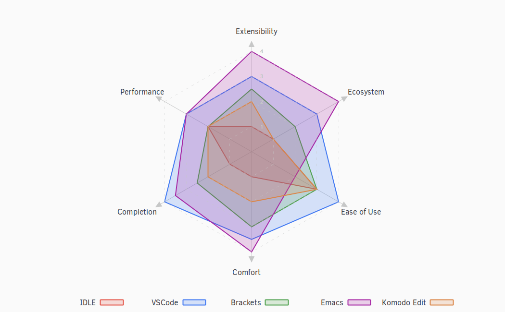

# My Doom Emacs config

[[_TOC_]]

# About Emacs


Emacs changes how you _think_ about programming.

Emacs is **totally introspectable**. You can always find out &rsquo;what code runs when I press this button?&rsquo;.

Emacs is an **incremental programming environment**. There&rsquo;s no edit-compile-run cycle. There isn&rsquo;t even an edit-run cycle. You can execute snippets of code and gradually turn them into a finished project. There&rsquo;s no distinction between your editor and your interpreter.

Emacs is a **mutable environment**. You can set variables, tweak functions with advice, or redefine entire functions. Nothing is off-limits.

Emacs provides **functionality without applications**. Rather than separate applications, functionality is all integrated into your Emacs instance. Amazingly, this works. Ever wanted to use the same snippet tool for writing C++ classes as well as emails?

Emacs is full of **incredible software concepts that haven&rsquo;t hit the mainstream yet**. For example:

- Many platforms have a single item clipboard. Emacs has an **infinite clipboard**.
- If you undo a change, and then continue editing, you can&rsquo;t redo the original change. Emacs allows **undoing to any historical state**, even allowing tree-based exploration of history.
- Emacs supports a **reverse variable search**: you can find variables with a given value.
- You can perform **structural editing** of code, allowing you to make changes without breaking syntax. This works for lisps (paredit) and non-lisps (smartparens).
- Many applications use a modal GUI: for example, you can&rsquo;t do other edits during a find-and-replace operation. Emacs provides **recursive editing** that allow you to suspend what you&rsquo;re currently doing, perform other edits, then continue the original task.

Emacs has a **documentation culture**. Emacs includes a usage manual, a lisp programming manual, pervasive docstrings and even an interactive tutorial.

Emacs has a **broad ecosystem**. If you want to edit code in a niche language, there&rsquo;s probably an Emacs package for it.

Emacs doesn&rsquo;t have a monopoly on good ideas, and there are other great tools out there. Nonetheless, we believe the Emacs learning curve pays off.


_This beautifully written **About EMACS** section credits to [Remacs](https://github.com/remacs/remacs)._

Also if you want to read more about Emacs, checkout these articles

- [Why You Should Buy Into the Emacs Platform](https://two-wrongs.com/why-you-should-buy-into-the-emacs-platform)
- [I use emacs because&#x2026;](https://www.reddit.com/r/emacs/comments/hmtwbt/i_use_emacs_because/)

## Editor comparison


Also this graph by[ tecosaur](https://github.com/tecosaur/emacs-config/blob/master/config.org) describes the best



[Tecosaur&rsquo;s config](https://tecosaur.github.io/emacs-config/config.html)

# About my config

This Emacs config is a work of many hours painful polishing and trying to create a perfect work environment.

## Contribution

If you spotted a bug or you have any suggestions, please fill in an issue. If you have something to fix, feel free to create a pull request.

## Installation

Use the install directions from [Doom Emacs](https://github.com/hlissner/doom-emacs).

For specific instructions use `devfile.toml`.

## License

You have the permission to use, modify, distribute in any way you want.

However, what is _free_ stays _free_. After all, this is [GPL](LICENSE.md).

All the files inside the `doom.d` is licensed under the terms of GNU GENERAL PUBLIC LICENSE Version 3.

For more information [read the license](LICENSE.md).

## Repository mirroring

[My Doom Emacs config on Gitlab](https://gitlab.com/justinekizhak/dotfiles/-/tree/master/emacs/doom.d) (Main repo)

[My Doom Emacs config on Github](https://github.com/justinekizhak/dotfiles/tree/master/emacs/doom.d) (Mirror)

## Screenshots

### Dashboard


### Org mode


### Python mode


## Some helper guide

### [Doom Emacs Workflows](https://noelwelsh.com/posts/2019-01-10-doom-emacs.html)

## Sorting the headlines

To sort the headers in this file run `M-x org-sort-entries` and select alphabetically order.

## Special Thanks

Everyone starts somewhere, and I started here.

- [MatthewZMD](https://github.com/MatthewZMD/.emacs.d)
- [Henrik Lissner&rsquo;s Doom Emacs](https://github.com/hlissner/doom-emacs)

# Lexical Binding

Use lexical-binding. [Why?](https://nullprogram.com/blog/2016/12/22/)

> Until Emacs 24.1 (June 2012), Elisp only had dynamically scoped variables, a feature, mostly by accident, common to old lisp dialects. While dynamic scope has some selective uses, it’s widely regarded as a mistake for local variables, and virtually no other languages have adopted it.

```emacs-lisp
;;; config.el --- -*- lexical-binding: t -*-
```

# Personal Information

Let&rsquo;s set some variables with basic user information.

```emacs-lisp
(setq user-full-name "Justine Kizhakkinedath"
      user-mail-address "justine@kizhak.com")
```

# Defining constants

## Are we running on a GNU/Linux system?

```emacs-lisp
(defconst *sys/linux*
  (eq system-type 'gnu/linux))
```

## Are we running on a GUI Emacs?

```emacs-lisp
(defconst *sys/gui*
  (display-graphic-p))
```

## Are we running on a Mac system?

```emacs-lisp
(defconst *sys/mac*
  (eq system-type 'darwin))
```

## Are we running on a WinTel system?

```emacs-lisp
(defconst *sys/win32*
  (eq system-type 'windows-nt))
```

## Are you a ROOT user?

```emacs-lisp
(defconst *sys/root*
  (string-equal "root" (getenv "USER")))
```

## Check basic requirements for EAF to run.

```emacs-lisp
(defconst *eaf-env*
  (and *sys/linux* *sys/gui* *python3*
       (executable-find "pip")
       (not (equal (shell-command-to-string "pip freeze | grep '^PyQt\\|PyQtWebEngine'") ""))))
```

## Do we have clangd?

```emacs-lisp
(defconst *clangd*
  (or (executable-find "clangd")  ;; usually
      (executable-find "/usr/local/opt/llvm/bin/clangd")))  ;; macOS
```

## Do we have gcc?

```emacs-lisp
(defconst *gcc*
  (executable-find "gcc"))
```

## Do we have git?

```emacs-lisp
(defconst *git*
  (executable-find "git"))
```

## Do we have Maven?

```emacs-lisp
(defconst *mvn*
  (executable-find "mvn"))
```

## Do we have pdflatex?

```emacs-lisp
(defconst *pdflatex*
  (executable-find "pdflatex"))
```

## Do we have python3?

```emacs-lisp
(defconst *python3*
  (executable-find "python3"))
```

## Do we have python?

```emacs-lisp
(defconst *python*
  (executable-find "python"))
```

## Do we have ripgrep?

```emacs-lisp
(defconst *rg*
  (executable-find "rg"))
```

## Do we have tr?

```emacs-lisp
(defconst *tr*
  (executable-find "tr"))
```

# Some Emacs defaults

```emacs-lisp
(use-package emacs
  :preface
  (defvar ian/indent-width 2) ; change this value to your preferred width
  :config
  (setq
    ring-bell-function 'ignore       ; minimise distraction
    frame-resize-pixelwise t
    default-directory "~/")

  (tool-bar-mode -1)
  (menu-bar-mode -1)

  ;; increase line space for better readability
  (setq-default line-spacing 3)

  ;; Always use spaces for indentation
  (setq-default indent-tabs-mode nil
                tab-width ian/indent-width))

```

# Better editing experience

## Automatically refreshes the buffer for changes outside of Emacs

Auto refreshes every 2 seconds. Don’t forget to refresh the version control status as well.

```emacs-lisp
(use-package autorevert
  :defer t
  :ensure nil
  :config
  (global-auto-revert-mode +1)
  (setq auto-revert-interval 2
        auto-revert-check-vc-info t
        auto-revert-verbose nil))
```

## Confirm kill process

Don’t bother confirming killing processes

```emacs-lisp
(use-package files
  :defer t
  :config
  (setq confirm-kill-processes nil))
```

## Disable scroll bar

```emacs-lisp
(use-package scroll-bar
  :defer t
  :ensure nil
  :config (scroll-bar-mode -1))
```

## History

```emacs-lisp
(use-package recentf
  :defer t
  :ensure nil
  :hook (after-init . recentf-mode)
  :custom
  (recentf-auto-cleanup "05:00am")
  (recentf-max-saved-items 200)
  (recentf-exclude '((expand-file-name package-user-dir)
                     ".cache"
                     ".cask"
                     ".elfeed"
                     "bookmarks"
                     "cache"
                     "ido.*"
                     "persp-confs"
                     "recentf"
                     "undo-tree-hist"
                     "url"
                     "COMMIT_EDITMSG\\'")))

;; When buffer is closed, saves the cursor location
(save-place-mode 1)

;; Set history-length longer
(setq-default history-length 500)
```

## Modernize selection behavior

Replace the active region just by typing text, just like modern editors

```emacs-lisp
(use-package delsel
  :disabled
  :ensure nil
  :config (delete-selection-mode +1))
```

```emacs-lisp
(setq delete-selection-mode t)
```

## Show matching parentheses

Reduce the highlight delay to instantly.

```emacs-lisp
(use-package paren
  :defer t
  :ensure nil
  :init (setq show-paren-delay 0.5)
  :config (show-paren-mode +1))
```

# Appearance

## Dashboard with images

Use the image in the dotfiles folder as the dashboard splash image

```emacs-lisp
(add-hook! '(+doom-dashboard-mode-hook)
           ;; Crypto logo
           (setq fancy-splash-image "~/dotfiles/emacs/doom.d/images/crypto.png"))
```

## Setting up some frame defaults

Maximize the frame by default on start-up. Set the font to BlexMono, if BlexMono is installed.

```emacs-lisp
(use-package frame
  :ensure t
  :config
  (add-to-list 'default-frame-alist '(fullscreen . maximized)))
```

# Custom Keybinding

## Window management

### Jump to any window using `SPC w M-w`

Unbind existing `SPC w C-w` for Ace window

```emacs-lisp
(map! :leader
      (:prefix ("w")
        "C-w" nil))
```

Bind `SPC w M-w` for Ace window

```emacs-lisp
(map! :leader
      (:prefix ("w" . "window")
        :desc "Jump to any window using Ace" "M-w" #'ace-window))
```

## ⌘ + a → Select all

```emacs-lisp
(map! "M-a" #'mark-whole-buffer)
```

## ⌘ + s → Save file

```emacs-lisp
(map! "M-s" #'save-buffer)
```

## ⌘ + v → Paste menu

```emacs-lisp
(map! "M-v" #'counsel-yank-pop)
```

# Packages

## Ace-popup

```emacs-lisp
(use-package ace-popup-menu
  :defer t)
```

## Annotate

[Github repo](https://github.com/bastibe/annotate.el)

This package provides a minor mode annotate-mode, which can add annotations to arbitrary files without changing the files themselves. This is very useful for code reviews.

```emacs-lisp
(use-package annotate)
```

## Apex Legends title

Use a random quote of a character from [Apex Legends](https://www.ea.com/games/apex-legends/play-now-for-free) as your frame title.

Requires [Apex Legends voicelines](https://pypi.org/project/apex-legends-voicelines/) python package.

### Install the package using

```sh
pipx install apex-legends-voicelines
```

### Usage

```emacs-lisp
(setq frame-title-format (shell-command-to-string "apex-voicelines"))

(defun change-emacs-title-apex ()
  "Change your Emacs frame title using the voicelines of `Apex Legends' characters.
This command requires `apex-legends-voicelines' python package."
  (interactive)
  (setq frame-title-format (shell-command-to-string "apex-voicelines")))
```

## Atomic chrome

Edit browser text in Emacs

```emacs-lisp
(use-package atomic-chrome)
(add-hook 'emacs-startup-hook (lambda ()
                                (if (daemonp)
                                    (atomic-chrome-start-server))))
```

## Clipmon

```emacs-lisp
(add-to-list 'after-init-hook 'clipmon-mode-start)
```

## Dired

```emacs-lisp
(use-package dired
  :defer t
  :ensure nil
  :bind
  (("C-x C-j" . dired-jump)
   ("C-x j" . dired-jump-other-window))
  :custom
  ;; Always delete and copy recursively
  (dired-recursive-deletes 'always)
  (dired-recursive-copies 'always)
  ;; Auto refresh Dired, but be quiet about it
  (global-auto-revert-non-file-buffers t)
  (auto-revert-verbose nil)
  ;; Quickly copy/move file in Dired
  (dired-dwim-target t)
  ;; Move files to trash when deleting
  (delete-by-moving-to-trash t)
  ;; Load the newest version of a file
  (load-prefer-newer t)
  ;; Detect external file changes and auto refresh file
  (auto-revert-use-notify nil)
  (auto-revert-interval 3) ; Auto revert every 3 sec
  :config
  ;; Enable global auto-revert
  (global-auto-revert-mode t)
  ;; Reuse same dired buffer, to prevent numerous buffers while navigating in dired
  (put 'dired-find-alternate-file 'disabled nil)
  :hook
  (dired-mode . (lambda ()
                  (dired-hide-details-mode)
                  (local-set-key (kbd "<mouse-2>") #'dired-find-alternate-file)
                  (local-set-key (kbd "RET") #'dired-find-alternate-file)
                  (local-set-key (kbd "^")
                                 (lambda () (interactive) (find-alternate-file ".."))))))
```

## Drag lines

### Vertically

```emacs-lisp
(map!
    :n "M-k" #'drag-stuff-up    ; drags line up
    :n "M-j" #'drag-stuff-down)  ; drags line down
```

### Horizontally

```emacs-lisp
(with-eval-after-load 'evil-org
  (map!
    :n "M-l" #'evil-org->       ; indents line to left
    :n "M-h" #'evil-org-<))      ; indents line to right
```

## Easy escape

Now no more double backslash hell. [Github repo](https://github.com/cpitclaudel/easy-escape)


```emacs-lisp
(use-package easy-escape
  :defer t
  :config
    (set-face-attribute 'easy-escape-face nil :foreground "red"))
```

## Evil snipe

```emacs-lisp
(use-package evil-snipe
  :defer t
  :config
  (setq evil-snipe-scope 'visible)
  (setq evil-snipe-repeat-scope 'buffer)
  (setq evil-snipe-spillover-scope 'whole-buffer))
```

## EWW

Emacs Web Wowser, the HTML-based Emacs Web Browser.

```emacs-lisp
(use-package eww
  :defer t
  :ensure nil
  :commands (eww)
  :hook (eww-mode . (lambda ()
                      "Rename EWW's buffer so sites open in new page."
                      (rename-buffer "eww" t)))
  :config
  ;; I am using EAF-Browser instead of EWW
  (unless *eaf-env*
    (setq browse-url-browser-function 'eww-browse-url))) ; Hit & to browse url with system browser
```

## Flycheck

Flycheck, a syntax checking extension.

```emacs-lisp
(use-package flycheck
  :defer t
  :hook (prog-mode . flycheck-mode)
  :custom
  (flycheck-emacs-lisp-load-path 'inherit)
  :config
  (flycheck-add-mode 'javascript-eslint 'js-mode)
  (flycheck-add-mode 'typescript-tslint 'rjsx-mode))
```

## Go to line preview

```emacs-lisp
(use-package goto-line-preview
  :defer 3
  :config
    (global-set-key [remap goto-line] 'goto-line-preview))
```

## HTMLize

HTMLize, a tool that converts buffer text and decorations to HTML

```emacs-lisp
(use-package htmlize
  :defer t)
```

## Hydra

```emacs-lisp
(use-package hydra
  :defer t)
```

## Iedit

Iedit, a minor mode that allows editing multiple regions simultaneously in a buffer or a region.

```emacs-lisp
(use-package iedit
  :defer t
  :diminish)
```

## Indent tools

Indent, move around and act on code based on indentation (yaml, python, jade, etc). Meant for indentation-based languages, but can be used any time with indented text.

```emacs-lisp
(use-package indent-tools
  :defer t
  :after (hydra)
  :bind ("C-c >" . #'indent-tools-hydra/body))
```

## LSP

```emacs-lisp
(setq lsp-ui-doc-max-height 30)
(setq lsp-ui-doc-max-width 150)
```

## Org mode

Don&rsquo;t display images in a org file which has images. To show image `M-x` `org-toggle-inline-images` OR use keybinding `z i`

```emacs-lisp
(use-package org
  :defer t
  :config
  (setq org-startup-with-inline-images nil)
  (setq org-startup-shrink-all-tables t)
  (setq org-use-property-inheritance t)
  (setq org-hide-emphasis-markers t)
  ; Fix `org-cycle' bug
  (map! :map org-mode-map
        :n "<tab>" 'org-cycle)
  ; Add plantUML
  (add-to-list 'org-src-lang-modes '("plantuml" . plantuml))
  (setq org-plantuml-jar-path "~/plantuml.jar")
  (setq plantuml-default-exec-mode 'jar)
  ; Add graphviz
  (add-to-list 'org-src-lang-modes  '("dot" . graphviz-dot))
  (setq org-ellipsis "⬎"))
   ;; ➡, ⚡, ▼, ↴, , ∞, ⬎, ⤷, ⤵
```

### Better reading experience

Taken from[ Beautifying Org Mode in Emacs by zzamboni](https://zzamboni.org/post/beautifying-org-mode-in-emacs/)


```emacs-lisp
(font-lock-add-keywords 'org-mode
                        '(("^ *\\([-]\\) "
                           (0 (prog1 () (compose-region (match-beginning 1) (match-end 1) "•"))))))

(let* ((variable-tuple
        (cond ((x-list-fonts "ETBembo")         '(:font "ETBembo"))
              ((x-list-fonts "Source Sans Pro") '(:font "Source Sans Pro"))
              ((x-list-fonts "Lucida Grande")   '(:font "Lucida Grande"))
              ((x-list-fonts "Verdana")         '(:font "Verdana"))
              ((x-family-fonts "Sans Serif")    '(:family "Sans Serif"))
              (nil (warn "Cannot find a Sans Serif Font.  Install Source Sans Pro."))))
       (headline           `(:inherit default :weight bold)))

  (custom-theme-set-faces
   'user
   `(org-level-8 ((t (,@headline ,@variable-tuple))))
   `(org-level-7 ((t (,@headline ,@variable-tuple))))
   `(org-level-6 ((t (,@headline ,@variable-tuple))))
   `(org-level-5 ((t (,@headline ,@variable-tuple :height 1.1))))
   `(org-level-4 ((t (,@headline ,@variable-tuple :height 1.2))))
   `(org-level-3 ((t (,@headline ,@variable-tuple :height 1.3))))
   `(org-level-2 ((t (,@headline ,@variable-tuple :height 1.4))))
   `(org-level-1 ((t (,@headline ,@variable-tuple :height 1.5))))
   `(org-document-title ((t (,@headline ,@variable-tuple :height 2.0 :underline nil))))))


(custom-theme-set-faces
 'user
 '(variable-pitch ((t (:family "ETBembo" :height 160))))
 '(fixed-pitch ((t ( :family "Fira Code" :height 160)))))

(add-hook 'org-mode-hook 'variable-pitch-mode)
(add-hook 'org-mode-hook 'visual-line-mode)

(custom-theme-set-faces
 'user
 '(org-block ((t (:inherit fixed-pitch))))
 '(org-code ((t (:inherit (shadow fixed-pitch)))))
 '(org-document-info ((t (:foreground "dark orange"))))
 '(org-document-info-keyword ((t (:inherit (shadow fixed-pitch)))))
 '(org-indent ((t (:inherit (org-hide fixed-pitch)))))
 '(org-link ((t (:foreground "royal blue" :underline t))))
 '(org-meta-line ((t (:inherit (font-lock-comment-face fixed-pitch)))))
 '(org-property-value ((t (:inherit fixed-pitch))) t)
 '(org-special-keyword ((t (:inherit (font-lock-comment-face fixed-pitch)))))
 '(org-table ((t (:inherit fixed-pitch :foreground "#83a598"))))
 '(org-tag ((t (:inherit (shadow fixed-pitch) :weight bold :height 0.8))))
 '(org-verbatim ((t (:inherit (shadow fixed-pitch))))))
```

### Org agenda

```emacs-lisp
(setq org-agenda-files (list "~/org/project/" "~/org/todo.org"))

(setq
  org-deadline-warning-days 7
  org-agenda-breadcrumbs-separator " ❱ "
  org-directory "~/org")
```

Copied from [psamim&rsquo;s config](https://github.com/psamim/dotfiles/blob/master/doom/config.el).

```emacs-lisp
(customize-set-value
    'org-agenda-category-icon-alist
    `(
      ("work" "~/.doom.d/icons/money-bag.svg" nil nil :ascent center)
      ("chore" "~/.doom.d/icons/loop.svg" nil nil :ascent center)
      ("events" "~/.doom.d/icons/calendar.svg" nil nil :ascent center)
      ("todo" "~/.doom.d/icons/checklist.svg" nil nil :ascent center)
      ("walk" "~/.doom.d/icons/walk.svg" nil nil :ascent center)
      ("solution" "~/.doom.d/icons/solution.svg" nil nil :ascent center)))
```

```emacs-lisp
(setq-hook! org-mode
  org-log-done t
  org-columns-default-format "%60ITEM(Task) %20TODO %10Effort(Effort){:} %10CLOCKSUM"
  org-global-properties (quote (("Effort_ALL" . "0:15 0:30 0:45 1:00 2:00 3:00 4:00 5:00 6:00 0:00")
                                ("STYLE_ALL" . "habit")))
  org-archive-location "~/org/archive/todo.org.gpg::")

(setq org-agenda-block-separator (string-to-char " "))

(setq org-agenda-custom-commands
      '(("o" "My Agenda"
         ((todo "TODO" ()
                      (org-agenda-overriding-header "\n⚡ Do Today:\n⎺⎺⎺⎺⎺⎺⎺⎺⎺")
                      (org-agenda-remove-tags t)
                      (org-agenda-prefix-format " %-2i %-15b")
                      (org-agenda-todo-keyword-format ""))

          (agenda "" (
                      (org-agenda-start-day "+0d")
                      (org-agenda-span 5)
                      (org-agenda-overriding-header "⚡ Schedule:\n⎺⎺⎺⎺⎺⎺⎺⎺⎺")
                      (org-agenda-repeating-timestamp-show-all nil)
                      (org-agenda-remove-tags t)
                      (org-agenda-prefix-format   "  %-3i  %-15b %t%s")
                      (org-agenda-todo-keyword-format " ☐ ")
                      (org-agenda-current-time-string "⮜┈┈┈┈┈┈┈ now")
                      (org-agenda-scheduled-leaders '("" ""))
                      (org-agenda-time-grid (quote ((daily today remove-match)
                                                    (0900 1200 1500 1800 2100)
                                                    "      " "┈┈┈┈┈┈┈┈┈┈┈┈┈")))))))))
```

### Org bullets

Better bullets for org mode.


```emacs-lisp
(use-package org-bullets
  :config
  (add-hook 'org-mode-hook (lambda () (org-bullets-mode 1))))
```

### Org LaTeX

Use color links when exported from Org to Latex

```emacs-lisp
(setq org-latex-hyperref-template "\\hypersetup{\n pdfauthor={%a},\n pdftitle={%t},\n pdfkeywords={%k},\n pdfsubject={%d},\n pdfcreator={%c}, \n pdflang={%L}, \n colorlinks = true}\n")
```

### Org Reveal

```emacs-lisp
(use-package ox-reveal
    :defer 3
    :config
    (setq org-reveal-root "/Users/justinkizhakkinedath/revealjs")
    (setq org-reveal-mathjax t))
```

### Ox-gfm

Github Flavored Markdown exporter for Org Mode

```emacs-lisp
(use-package ox-gfm
  :defer 3)
```

### Org ref

Citations, cross-references, indexes, glossaries and bibtex utilities for org-mode

[Github repo](https://github.com/jkitchin/org-ref)

```emacs-lisp
(use-package org-ref
  :config
  (setq reftex-default-bibliography '("~/org/references.bib"))

  ;; see org-ref for use of these variables
  (setq org-ref-bibliography-notes "~/org/notes.org"
        org-ref-default-bibliography '("~/org/references.bib")
        org-ref-pdf-directory "~/org/bibtex-pdfs/"))

(setq bibtex-completion-bibliography "~/org/references.bib"
      bibtex-completion-library-path "~/org/bibtex-pdfs"
      bibtex-completion-notes-path "~/org/helm-bibtex-notes")

;; open pdf with system pdf viewer (works on mac)
(setq bibtex-completion-pdf-open-function
  (lambda (fpath)
    (start-process "open" "*open*" "open" fpath)))
```

## Parinfer

```emacs-lisp
(use-package parinfer
  :defer t)
```

## Pipenv

```emacs-lisp
(use-package pipenv
  :defer t)
```

## PlantUML

```emacs-lisp
(use-package plantuml-mode
  :defer t)
```

## Powerthesaurus

```emacs-lisp
(use-package powerthesaurus
  :defer t)
```

### Keybinding

```emacs-lisp
(map! :leader
      (:prefix ("a" . "applications")
        :desc "Use powerthesaurus to fetch better word" "p" #'powerthesaurus-lookup-word-dwim))
```

## Projectile

```emacs-lisp
(use-package projectile
  :config
    (setq  projectile-project-search-path '("~/projects")))
```

## Ripgrep

```emacs-lisp
(use-package deadgrep
  :defer 3
  :config
    (map! :leader
      (:prefix ("a" . "applications")
        :desc "Open Ripgrep interface" "r" #'deadgrep)))
```

## String-inflection

```emacs-lisp
(use-package string-inflection
  :defer t)
```

### Keybinding

```emacs-lisp
(map! :leader
    (:prefix ("a" . "applications")
        :desc "Cycle through string case using String-inflection" "c" #'string-inflection-all-cycle))
```

## Treemacs magit

```emacs-lisp
(use-package treemacs-magit
  :defer t
  :after (treemacs magit))
```

## Undo tree

Undo tree, a feature that provides a visualization of the undos in a file.

```emacs-lisp
(use-package undo-tree
  :defer t
  :custom
  (undo-tree-visualizer-diff t)
  (undo-tree-visualizer-timestamps t))
```

## VTerm

### Add clickable links inside terminal

```emacs-lisp
(add-hook 'vterm-mode-hook #'goto-address-mode)
```

### Vterm paste using vim keybind

```emacs-lisp
(map! :map vterm-mode-map
      :n "P" #'vterm-yank
      :n "p" #'vterm-yank)
```

## Web development

### Web mode

Web mode, a major mode for editing web templates.

```emacs-lisp
(use-package web-mode
  :defer 3
  :custom-face
  (css-selector ((t (:inherit default :foreground "#66CCFF"))))
  (font-lock-comment-face ((t (:foreground "#828282"))))
  :mode
  ("\\.phtml\\'" "\\.tpl\\.php\\'" "\\.[agj]sp\\'" "\\.as[cp]x\\'"
   "\\.erb\\'" "\\.mustache\\'" "\\.djhtml\\'" "\\.[t]?html?\\'")
  :config
  (setq
   web-mode-markup-indent-offset 2
   web-mode-code-indent-offset 2
   web-mode-css-indent-offset 2))
```

### JavaScript/TypeScript

1.  JavaScript2 Mode

    JS2 mode, a feature that offers improved JavsScript editing mode.

    ```emacs-lisp
    (use-package js2-mode
      :defer 3
      :mode "\\.js\\'"
      :interpreter "node")
    ```

2.  TypeScript Mode

    TypeScript mode, a feature that offers TypeScript support for Emacs.

    ```emacs-lisp
    (use-package typescript-mode
      :defer 3
      :mode "\\.ts\\'"
      :commands (typescript-mode))
    ```

### Prettier

```emacs-lisp
(use-package prettier-js
  :defer 3
  :hook js2-mode)
```

### Emmet

Emmet, a feature that allows writing HTML using CSS selectors along with C-j. See usage for more information.

```emacs-lisp
(use-package emmet-mode
  :defer 3
  :hook ((web-mode . emmet-mode)
         (css-mode . emmet-mode)))
```

### Instant Rename Tag

Instant Rename Tag, a plugin that provides ability to rename html tag pairs instantly.

```emacs-lisp
(use-package instant-rename-tag
  :defer 3
  :load-path (lambda () (expand-file-name "~/dotfiles/emacs/packages/instant-rename-tag"))
  :config
  (map! :leader
        (:prefix ("m" . "local leader")
          :desc "Instantly rename opening/closing HTML tag" "o" #'instant-rename-tag)))
```

### JSON

JSON Mode, a major mode for editing JSON files.

```emacs-lisp
(use-package json-mode
  :defer 3
  :mode "\\.json\\'")
```

### Web beautify

```emacs-lisp
(eval-after-load 'css-mode
  '(add-hook 'css-mode-hook
             (lambda ()
               (add-hook 'before-save-hook 'web-beautify-css-buffer t t))))
```

```emacs-lisp
(eval-after-load 'prettier-js
  '(add-hook 'web-mode-hook
             (lambda ()
               (add-hook 'before-save-hook 'prettier-js-mode))))
```

### VueJS

```emacs-lisp
(add-hook 'vue-mode-hook #'lsp-deferred)  ;; Add lsp support to dart
(delete '("\\.vue\\'". web-mode) auto-mode-alist)  ;;; Remove web-mode from vue files and then add vue mode to it

(use-package vue-mode
  :defer 1
  :mode "\\.vue\\'")
(with-eval-after-load 'lsp-mode
  (mapc #'lsp-flycheck-add-mode '(typescript-mode js-mode css-mode vue-html-mode)))
```

1.  Prettier

    ```emacs-lisp
    (eval-after-load 'prettier-js
      '(add-hook 'vue-mode-hook
                 (lambda ()
                   (add-hook 'before-save-hook 'prettier-js-mode))))
    ```

# Languages

## Dart

```emacs-lisp
(add-hook 'dart-mode-hook #'lsp-deferred)  ;; Add lsp support to dart
```

## Emacs lisp

```emacs-lisp
(add-hook 'emacs-lisp-mode-hook
          (lambda ()
            (setq-local company-backends '((company-capf company-dabbrev-code company-files)))
            (setq tab-width 2)))

(add-hook 'emacs-lisp-mode-hook 'easy-escape-minor-mode)
```

## Markdown

On save refresh markdown table of contents.

```emacs-lisp
(add-hook 'gfm-mode-hook
          (lambda () (when buffer-file-name
                       (add-hook 'before-save-hook
                                 'markdown-toc-refresh-toc))))
```

## Python

Adding TabNine completion to buffer

```emacs-lisp
(use-package python-mode
  :defer t
  :mode "\\.py\\'"
  :custom
  (python-indent-offset 4))
```

## TeX

```emacs-lisp
(use-package tex
  :disabled
  :ensure auctex
  :defer t
  :custom
  (TeX-auto-save t)
  (TeX-parse-self t)
  (TeX-master nil)
  ;; to use pdfview with auctex
  (TeX-view-program-selection '((output-pdf "pdf-tools"))
                              TeX-source-correlate-start-server t)
  (TeX-view-program-list '(("pdf-tools" "TeX-pdf-tools-sync-view")))
  (TeX-after-compilation-finished-functions #'TeX-revert-document-buffer)
  :hook
  (LaTeX-mode . (lambda ()
                  (turn-on-reftex)
                  (setq reftex-plug-into-AUCTeX t)
                  (reftex-isearch-minor-mode)
                  (setq TeX-PDF-mode t)
                  (setq TeX-source-correlate-method 'synctex)
                  (setq TeX-source-correlate-start-server t)))
  :config
  (when (version< emacs-version "26")
    (add-hook LaTeX-mode-hook #'display-line-numbers-mode)))
```

## YAML

```emacs-lisp
(add-hook 'yaml-mode-hook 'highlight-indent-guides-mode)

(use-package yaml-mode
  :defer t
  :mode ("\\.yaml\\'" "\\.yml\\'")
  :commands (yaml-mode))
```

# Other config

## Backup

```emacs-lisp
;; Enable backup
(setq make-backup-files t)

;; Backup by copying
(setq backup-by-copying t)
```

### Auto save files when Emacs is out of focus

Ref: [Emacs auto save files](http://ergoemacs.org/emacs/emacs_auto_save.html)

```emacs-lisp
(defun xah-save-all-unsaved ()
  "Save all unsaved files. no ask.
Version 2019-11-05"
  (interactive)
  (save-some-buffers t ))

;; when switching out of emacs, all unsaved files will be saved
(add-hook 'focus-out-hook 'xah-save-all-unsaved)
```

## Create a paste-transient-state to cycle through kill ring on paste

Refer [doom docs on paste transient](https://github.com/hlissner/doom-emacs/blob/cd1675568bdbb388f931591ea6383fa8ded82765/docs/api.org#create-a-paste-transient-state-to-cycle-through-kill-ring-on-paste)

```emacs-lisp
(defhydra hydra-paste (:color red
                       :hint nil)
  "\n[%s(length kill-ring-yank-pointer)/%s(length kill-ring)] \
 [_C-j_/_C-k_] cycles through yanked text, [_p_/_P_] pastes the same text \
 above or below. Anything else exits."
  ("C-j" evil-paste-pop)
  ("C-k" evil-paste-pop-next)
  ("p" evil-paste-after)
  ("P" evil-paste-before))

(map! :nv "p" #'hydra-paste/evil-paste-after
      :nv "P" #'hydra-paste/evil-paste-before)
```

## Refresh file automatically

When a file is updated outside emacs, make it update if it&rsquo;s already opened in emacs

Ref: <http://ergoemacs.org/emacs/emacs_misc_init.html>

```emacs-lisp
(global-auto-revert-mode 1)
```

## Use Command key as meta key (Only on MacOS)

```emacs-lisp
(setq mac-command-modifier 'meta)
```

# Post Initialization

## Play startup music

Play Apex Legends music when booting up Emacs.

```emacs-lisp
(defun async-shell-command-no-window (command)
  (interactive)
  (let
      ((display-buffer-alist
        (list
         (cons
          "\\*Async Shell Command\\*.*"
          (cons #'display-buffer-no-window nil)))))
    (async-shell-command
     command)))

(defun run-crypto-music (&optional frame)
  (async-shell-command-no-window "/usr/bin/afplay ~/dotfiles/emacs/doom.d/audio/Crypto.wav"))

(add-hook 'after-make-frame-functions 'run-crypto-music)

(add-hook 'emacs-startup-hook (lambda ()
                                (if (not (daemonp))
                                    (run-crypto-music))))
```

# Fun stuffs

## Play some music

```emacs-lisp
(defun play-audio-file (file-name)
  "Play a audio file. Input audio file."
  (interactive "faudio-file: ")
  (async-shell-command-no-window (concat "/usr/bin/afplay " file-name)))
```
